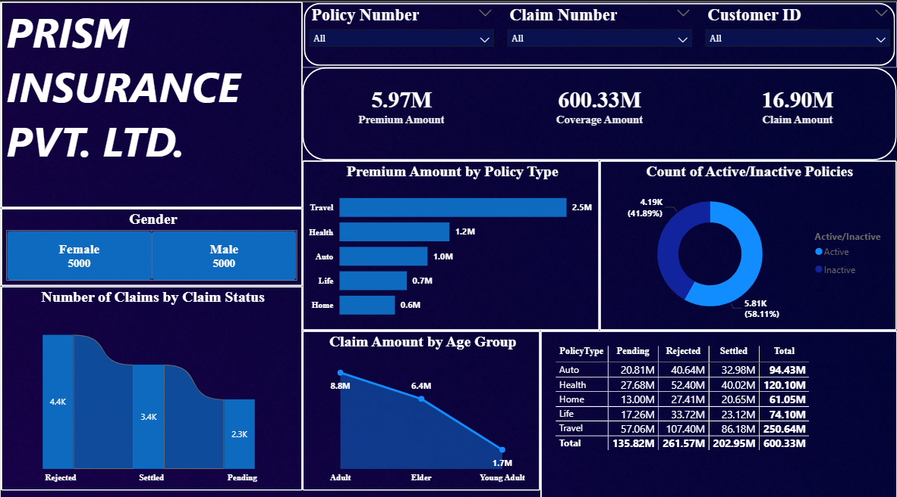

# Enterprise Insurance Performance & Data Pipeline Solution

## Project Architecture & Data Workflow
This project demonstrates an end-to-end data processing and analytics pipeline using an **ELT (Extract, Load, Transform)** workflow designed to process large-scale transactional insurance records.

1. **Extraction & Staging:** Ingested raw insurance transaction matrices from structured Excel databases into an enterprise **SQL Server** environment under the database `Insurancedb`.
2. **Database Verification:** Configured database environments and handled schema overrides during initial staging to correct mismatched column data types. Executed the verification script `Insurancedb.sql` to audit ingestion results and guarantee structural data hygiene.
3. **Power Query Modeling:** Established a direct connection from Power BI to the SQL Server database. Built robust conditional column logic within the **Power Query Editor** to segment demographics and categorize high-impact variables into dynamic business dimensions.
4. **Data Visualization:** Developed a clean, high-performance visual layout (`Insurance Data Dashboard.pbix`) using customized DAX expressions to compute critical business KPIs, tracking policy growth, claim loss distributions, and operational risk metrics.

## Dashboard Preview

## Data Modeling & Architecture
* **Data Structure:** Utilized a **de-normalized, flat-file database model** within SQL Server to optimize data retrieval speeds by eliminating complex runtime table JOIN operations. 
* **Engine Optimization:** The flattened database layout maximizes Power BI's internal VertiPaq columnar engine compression efficiency, ensuring instantaneous cross-filtering and metric responsiveness across the entire layout.
* **Feature Engineering:** Leveraged Power Query to dynamically inject conditional evaluation logic directly into the flat-file schema without modifying or corrupting the underlying database source.

## Core Technical Stack
* **Database Engine:** SQL Server (Data Ingestion, Environment Configuration, Structural Validation Checking via `Insurancedb.sql`)
* **Data Transformation:** Power Query M-Engine (Conditional Column Mapping, Data Sanitization)
* **Business Intelligence Engine:** Power BI Desktop (Data Modeling, Advanced DAX Scripting via `Insurance Data Dashboard.pbix`)
* **Workflow Acceleration:** Generative AI (Claude) leveraged to design optimized database schema architectures and cross-functional DAX KPI mappings.

## Key Technical Implementations
* Formatted complex matrix visuals to handle dynamic scale metrics, shortening raw multi-digit numbers into highly readable millions abbreviated values ($M).
* Architected automated data labels and conditional callout parameters to track claim frequency and loss ratios cleanly.
* Fixed text overlapping and interface padding constraints to ensure a 100% executive-ready dashboard interface.
